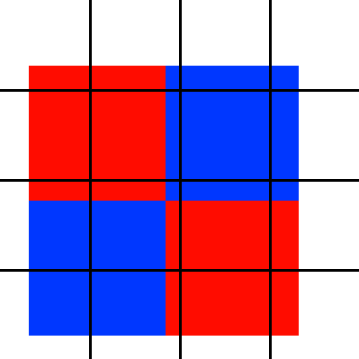
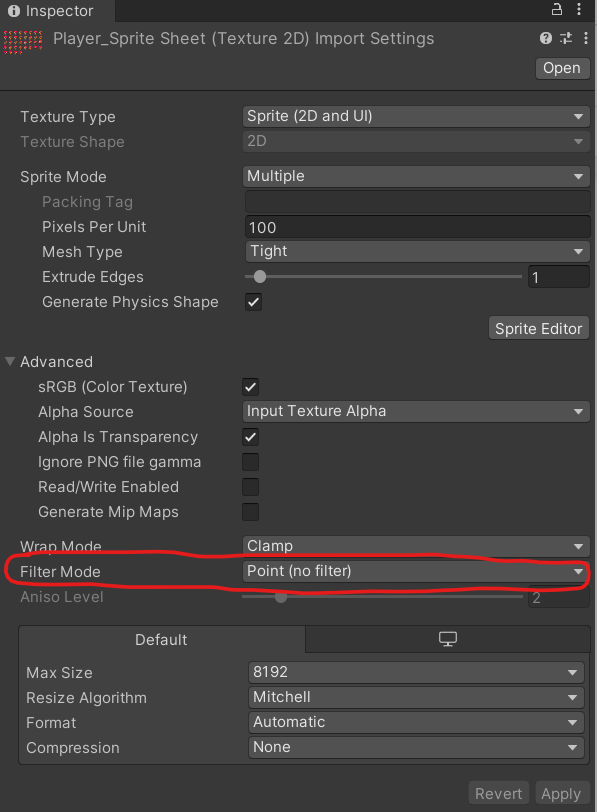
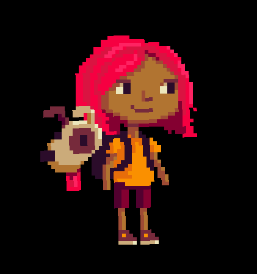

Prerequisites
=============

To follow that tutorial, you will need to know about :

- How to navigate and use the Unity editor
- How a 3D scene works and what are 3D coordinates

Introduction
============

If you tried to render 2D asset that have a “pixel art” style in Unity, you may
have found that with all the default settings, your final image was looking
muddy/blurry and pixels appeared to wobble when objects moved on screen.

This is because of how 2D is rendered in a modern engine and there are a number
of steps we have to take to ensure everything render as we expected, with clear
sharp pixels.

This article will go in details on why those rendering problems appear.
If you only want to have a run down of all the steps to take to ensure a
crisp pixel art rendering, you can just have a look at the final [References](#references)

2D Rendering in a 3D engine
===========================

To understand the root of the problem, we need a small primer on how 2D is
rendered in a 3D engine. On older computers and console systems, the rendering
was pixel based. A simplified summary of that was that the pixels of the sprites
you wanted to display were copied from the memory to the pixels of the screen,
at a 1:1 match.

But modern systems all have a GPU dedicated to rendering things fast on to the
screen, and they render at resolution way higher (even if your game is made to
look like it is 280x244 pixels for example, your computer/console still render
on a screen that is usually 1920x1080 pixels or more, it is just “zoomed”).

So to leverage the GPU capabilities (which was made to render 3D polygons fast)
we instead render our 2D image as texture on flat polygons in front of an
orthographic camera :


_The end result 2D rendering_


_The underlying polygons used_

Texture sampling and the sub-pixel problem
------------------------------------------

So instead of copying our pixels from our sprites to the screen pixels, we
instead render polygons. So let’s review how 3D rendering works :

1. We give the GPU a list of vertices that form polygons in a 3D space. In our
case, those vertices will form a flat shapes, either a square or a more complex
polygon

2. We give the GPU the position of this object and also the camera position and
projection settings. In our case our camera will use an orthographic projection.

3. The GPU will use all that information to calculate in a shader where on the
screen those polygons end up appearing.

If this is a bit confusing, do not worry, all you have to remember is that all
those steps are done to find which pixels the polygon covers on screen


Now for each pixel contained or touched by this polygon, we need to find which
color it should be given. One part of this in our case is using texture mapping.
Each vertex (point of the polygons) will have a given texture coordinate (also
sometime called UV) that gives which part of the texture covers it.


_As you can see there is no correlation between the pixel of the screen and the
pixel of the texture_

Which leads to a problem, in most case they won’t line up :


In this case a square polygon on which is mapped a 4 pixels texture (a checkerboard
pattern of blue and red) covers 9 pixels on screens. As seen, the middle column
of screen pixels are covered by 2 (or even 4) different pixels of the texture.

But a pixel of you screen can only take 1 color. So which color should we light
those pixels?

_(Note : to simplify the example, the square is fitting perfectly in those 3x3
screen pixels, but in nearly all of real life scenarios, the square will sit on
pixel boundaries, like the triangle in our previous illustrations. The situation
just worsen the "multiple possible color per pixels" problem)_


The answer to which color each screen pixel will take will actually depends on a
setting we set on our image asset: texture filtering.

Texture filtering will tell how to “mix” color when a pixel can have multiple
values. This setting can be set per texture in the importer settings in Unity :



And have 2 type of value :

- Filtering enabled (Bilinear or Trilinear filtering settings): This will “mix”
the multiple colors based on how much of each covers each pixel. So with our
example above we would get this kind of result  


- No Filtering (Point settings): this won’t interpolate (mix) the colors and
instead take the nearest pixel (hence why this is sometimes called Nearest Neighbor
method):  

Even at this simulated scale, we can see the resulting small result is losing the checkerboard pattern.

Pixel Art Sprite
================

Now that we have established how sprites are rendered and how texture mapping
works, let’s see why this is important for our pixel art rendering.

Modern screens are usually 1920x1080 pixels in size or bigger. This makes pixels
very numerous and very small. But pixel art needs pixels to be big and visible,
as they emulate older systems that were rendering at lower resolutions, like
256×224 or similar. This means we need to "zoom in".

Good thing is, it’s “free” (in terms of performance) to do as we use 3D rendering
: we just change the camera settings, and our polygon is now appearing bigger on
the screen at nearly no extra computing cost.

But this does also mean we are creating the situation we just explained, where
each pixel of our sprite covers multiple screen pixels, all misaligned with the
screen pixel grid. And this will create a lot of different problems.

Texture Filtering
-----------------

The first most obvious problem is texture filtering. As we saw in the previous
section, texture filtering will blend pixels together, but this means we lose a
clear, sharp edge between our pixels. This is an example of a sprite with and
without texture filtering :


So the first big thing to remember is to set all sprites textures filtering type
setting to Point, so no filtering is applied.

Pixel wobbling
--------------

The second big problem comes from movement of the polygons. As the polygons move
around, the type of sub-pixel imprecision will change.
Let’s see an example of that.


We saw that this kind of configuration would give something like that if using
point filtering


But what happen if we move the polygon a bit


The overlapping configuration have change, so the sampled texture pixel will too,
and this will result in this result this time


Just by moving a tiny bit, we have two very different result


This will make our sprites appear to be animated/changing over time on the screen,
despite the fact that it should have stayed the same.

In real case scenario, this will make the “zoomed” pixels of our sprite appear
to wobble as they will change in size on screen based on the sprite movement


So to fix all those problems, we need to make sure of one thing : our textures
(sprites) always fit the screen pixel grid so we never get in the case where the
texture sampling has to pick between multiple possible values.

This is done through a couple of things

### Zoom Factor

The first thing to make sure is that our zoom factor is always an integer value.

If we zoom our sprite twice, each pixel of our sprite will cover 4 pixels (2 by 2)
on screen. Zooming three times will cover 9 pixels etc.
If our zoom isn’t an integer value, we end up with our sub-pixel problem


A 2x2 pixel sprite zoomed only 1.5 time will result in sub-pixel problem

As our sprite are polygon, their size on screen (and so their “zoom” factor) is
defined by 2 things :

1. The size of the polygon in the scene
2. The camera settings

#### Polygon size

The size of the polygon will be defined by :

- The scale of the GameObject : you should always leave that to 1
- The Pixel Per Unit (PPU) setting on the import settings of the texture on which the sprite is  
    

The PPU setting will define how many pixels fit in 1 world unit.
If you have a 32x32 pixels sprite and set its PPU to 32, it will be 1 by 1 unit.
If you set its PPU to 16, it will be 2 by 2 units etc.

It’s important that all your sprites use the same PPU value.
Otherwise they would have a different pixel density, meaning their pixels will
appear to be a different size, which is against the pixel art look we seek.

A good value is taking the pixel size of your most common objects (your tiles,
your main characters etc..) as this will make them 1 unit in size which will
allow things like sound or physics to work with proper scale.

#### Camera settings

Sprite size will only define coherent relative size between sprites in the scene,
but their actual size on screen will depend on the camera settings.

The first important setting is setting your camera to orthographic.
Perspective by definition will create shape distortions on the side of the screen
(the perspective effect) and objects of the same size appear smaller when farther
away, both of those being incompatible with ensuring that we fit the pixel grid
at all times.
(How to keep things a proper size when that size and shape change all the time)

Orthographic cameras have a half-size setting that defines how much of the world
unit the camera can see on half its height.
_E.g. A half size of 1.5 means the camera can see 1.5 x 2 = 3 units of the world vertically._

By combining that with our Sprite PPU we can compute how much of our world we need
to show so our pixel grid matches perfectly.

Let’s take an example:

Our sprite PPU is 32, so there are 32 pixels per world unit.

Our screen is 1080 pixels in height.

```
32px => 1 units
1080px => ?
```

By doing `1080/32` we get 33.75 units that need to be visible.
Dividing that by 2 gives us 16.875 for half size.

By doing this, a 32 pixel sprite will fit exactly 32 pixels on the screen!
And by just dividing the half size by 2, that means we can “zoom” twice, by 3,
we zoom 3 time etc.

Doing this kind of computation by hand isn’t very practical. Thankfully Unity
has a built-in component to help with that, in the form of the Pixel Perfect
Camera component you need to add to the GameObject that has your Camera.

### Pixel Perfect Camera


Let’s explore each parameters :

- **Assets Pixel Per Unit** : this is the PPU you have set on all your textures.
- **Reference Resolution** : this is the resolution at which you designed your game.
This is very important to define one at the beginning of the project.
It can be as simple as taking the most common resolution on the platform you target
(e.g. 1920x1080) and divide it by the zoom factor you want (with a zoom of 4,
that’s 480x270), or a specific resolution if you want to emulate the look of a
given system. The camera will use that to compute the half size needed.
- **Upscale Render Texture** : if this is not set, this will render everything
as described until now, by setting the half size of the camera to the right value
so we have the proper full zoom factor to fit the pixel grid. But our screen,
our “final image” is still made of a lot of small pixels, it's just that our
sprite pixels are covering a lot of them.  
  If this setting is set, instead, Unity will render into a texture of the size
  of the Reference Resolution settings then stretch that texture so it fills the
  full screen.
  In short : instead of rendering zoomed sprites on a large pixel grid,
  it renders non-zoomed sprites on a texture the exact right size then stretches
  that texture.
  This will create similar result, but the biggest difference is visible when sprite rotates :


    
  _First is Upscale Render Texture off and second is on._  

  Rotating pixels will create the subpixel problem, there is no way about it
  (pixels that are for example 20 degree turned will never fit the screen pixel grid).  

  Without the RenderTexture, each rotated pixel of our sprite have multiple “tiny”
  pixels of the screen to still carry its color, keeping the overall shape with
  only imprecision on the border (you can see some shimmering on the legs for example)

  But with the Render texture setting used, each pixel of our sprite only match to
  1 pixel of the texture.
  It’s like we were rendering on a small screen and THEN stretching to the full screen.
  Here, each imprecision and pixel shift is very visible and mangles the sprite
  a lot more.  

  Ultimately, this is an aesthetic decision. Render texture upscale will give a
  look closer to what would have happened on those older systems we try to emulate,
  where no Render Texture will give a cleaner more modern look that gives more
  room for modern effects.

- **Pixel Snapping** :  This will only appear if we don’t use the Render Target,
but let’s leave that setting aside for a second we will come back to it very quickly.
- **Crop Frame (X and Y)** : these settings allow to display black bars on the
horizontal or vertical sides so the ratio stays the same as the reference
resolution. This is because of the fact that we need to keep our zoom factor as
integers. If we use our 480x270 base resolution,
this can be zoomed 4 time and fit perfectly in a 1920x1080 screen :
    
  _What is visible on screen at 1920x1080 resolution_  

  But if someone plays on a screen with a resolution of 1280x720, 720/270 is 2.66666.
  But we have to zoom integer value only, so we can only zoom twice, which will
  result in more world unit being fit vertically than in 1080p with a zoom of 4,
  and that mean a lot more of our game world will be visible  
    
  Note how we see a lot more of the world. We even see the blue background of
  the camera, as we designed our world with a 1080p resolution in mind and
  thought this would be out of view.  

  Setting the crop value mean black bars will be added to force the screen to only display the same area no matter the resolution:  

    

  As a lot of the screen can be lost that way, a “stretch fill” option on the
  Pixel Perfect Camera will appear when you enable cropping.
  This will simply stretch the view so no black bars are visible while still
  keeping the same area of the world visible.  

  But we reintroduce a mismatch between our game pixel and our screen pixel that
  way, leading to visible artefact. As those will never move though
  (you only stretch the game view which is fixed, your game is still rendered
  through that small window) they may be less distracting to users.

  That’s why lots of games expose that stretch fill option through their graphic
  option menu, letting the choice of pixel perfection but small game area or
  slight artefacts but full screen, to the end users.

### Pixel Snapping

Let’s go back to that pixel snapping settings that appear when you don’t enable
the Upscale Render Texture settings.

Until now we mainly talked about the zooming factor to ensure that the screen
pixel grid and our sprites pixels match, but we haven’t covered movement.
We saw in our example that movement can also create sub pixel problems.
That means we normally should only move our sprites at least 1 pixels in size.

Thankfully, the Pixel Perfect Camera takes care of that for us! It will enable
in the engine a special function that will snap our sprite just before rendering
them to the pixel grid. That means our GameObject position won’t be changed, and
we can continue to change them smoothly across time, and the snapping happens
before rendering automatically.

But if the Pixel Perfect Camera already do this, what is the Pixel Snapping
option for?

Well it allows to define to **which** pixel grid we are snapping to : our screen
or our reference resolution.

Here two animation showing first with the option off (snapping to the screen
pixel grid) and on (snapping to the reference resolution)


Here our Pixel Perfect Camera uses a reference resolution of 480x270,
and our screen is 1920x1080.

That means we zoom 4x, so each of our Sprite pixels covers 4x4 screen pixels.
But that does mean that we can move ¼ Sprite pixel in distance and still be
aligned to the **screen** pixels grid. The “downside” is that our sprites
won’t be aligned relative to each other as in our character pixels can be on half
of a background sprite pixels, which would be impossible on an older system.

This is what the Pixel Snapping option emulates. In the second example, instead
of snapping our position to the screen pixel grid it will snap to the reference
resolution pixel grid. That is why our movement is a lot more choppy
(we only have 420 possible position horizontally instead of 1920) but our
background sprite pixels and character sprite pixels will always be align on top
of each other, leading to a lot more “authentic” rendering as well as uniformed
gameplay experience (no matter the size of your screen, the character will
always move the same amount on the screen).

This setting really will depends on your personal and design choice.

References
==========

This part is a reference of all the settings and choice to make to ensure your
pixel art render properly in Unity. If you wonder why some of those are the way
they are, refer to the above article detailing 2D rendering in a 3D engine.

To ensure our pixel art is rendering correctly through a 3D engine, we need to
ensure our sprite pixels and our screen pixel grid always stay aligned.

To help with this we have to ensure multiple import settings and scene setup.
Note that all of these steps are for perfect “authentic” pixel perfect rendering.
You can experiment changing some of those to achieve a special style and more
modern rendering technique, but they each will come with their drawbacks.

1. Define a resolution at which we will design our game. Users will still be
able to choose their resolution, but for proper pixel art, we need to have a
“base” resolution. A simple way is to take the most common resolution
(e.g. 1920x1080) and divide it by the zoom factor we want
(e.g. 4, 1920x1080/4 = 480x270 reference resolution)
2. Import settings on Sprites :
    1. Make sure all Sprite use the same **PPU (Pixels Per Unit)** settings, so they
    all have the same pixel density. A good way is to take the size of the
    character of the tiles in our tilemap (e.g. 32x32 pixels) and set this as
    the PPU (32) so those tiles/character will be 1 unit in size, helping to
    keep other system like audio and physics in the right scale.
    2. Disable Texture filtering, so we don’t have “smoothed” texture sampling
    making our sprite blurry. We want to see those pixels. So set the **Texture
    Filtering to Point (no filter)**
    3. Disable Texture Compression : Compression is lossy, information is lost,
    and that will introduce graphical artifacts. Your sprites will take a lot
    more space on disk, but you’ll keep all your pixel details.
    **Set Compression to None**
3. Set the camera to orthographic. A perspective camera will distort shapes and
change size according to the set perspective settings, making it impossible to
fit the pixel grid at all times.
4. Add a Pixel Perfect Camera Component. This is part of URP natively
This will ensure to snap pixels to the screen pixel grid when rendering and will
help with computing some camera parameters and other special effects to achieve
the desired look. This is the parameters on it :
    1. Set your chosen reference resolution on the pixel perfect camera
    2. Set the common PPU you use on all your asset
    3. Choose if you use an **Upscaled Render Texture**
        - Not using it means you will “zoom” on the sprites, but keep your high
        pixel density on screen, so effectively your “Sprite pixels” will cover
        multiple of your “Screen pixels”. This allow to have smooth movement and
        smooth rotation  
        
        - Using a Render Target will render your sprite in a texture the size of
        your reference resolution, without zoom, and then this texture will be
        zoomed to fit the screen. This time, you have a 1:1 match between your
        sprites pixels and screen pixels, leaving no room for sub-pixels precision,
        so movement will be choppier and rotation will deform the sprites,
        but this will be more authentic to how pixel art was rendered on older
        system  
        
    4. **Pixel Snapping** will only appear if you don’t use an Upscaled Render Texture.
    This will mimic the choppy movement of the Upscaled Render Texture mode, by
    snapping to your reference resolution pixels instead of your screen pixels.
    Rotation remains unchanged and stays smoothed.
    5. **Crop Frame X/Y** when playing on a screen whose resolution isn’t fully
    divisible by the reference resolution, this allows to add black bars on the
    left/right side (x) and/or top/down side (Y).
    E.g a 1024x768 screen with a reference resolution of 480x270 would give a
    zoom factor of 2.666. But we have to zoom only non decimal zoom factor, so
    we have to stick to only zooming twice with additional part of the scene
    visible than with a 4x zoom at 1920x1080. To ensure that all users only see
    the same amount of the world, we can add black bars to frame the screens.
    6. **Stretch Fill**: this option only appears if both X/Y crops are set. Instead
    of adding black bar all around a small section on the center of the screen,
    this will stretch that small section so it fits as much of the screen as
    possible (keeping the aspect ratio of the reference resolution). As this is
    a stretch and this mean we now re-introduce mismatch between our rendered
    pixels and the screen pixels grid, this will introduce some blurry screen
    part and uneven pixels, but as the game itself is still render as it should,
    those artifacts will stay fixed in space and shape. **It is usually good
    practice to expose switching that setting through your application graphical
    options, so the user can make the final decision between a smaller crisp
    rendering area or a full screen less crisp one.**
